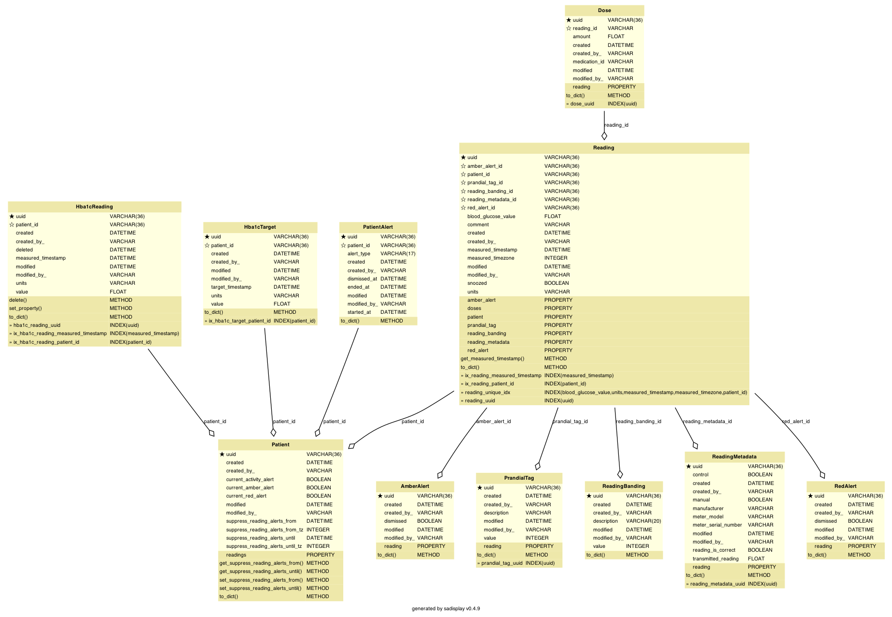

<!-- Title - A concise title for the service that fits the pattern identified and in use across all services. -->
# Polaris Blood Glucose Readings API

[](https://github.com/ambv/black)

<!-- Description - Fewer than 500 words that describe what a service delivers, providing an informative, descriptive, and comprehensive overview of the value a service brings to the table. -->
The BG Readings API is part of the Polaris platform (formerly DHOS). This service manages blood glucose readings, which 
contain information about a patient's health relating to diabetes, and details about these readings can be used by both
patients and clinicians to monitor their condition.

## Maintainers
The Polaris platform was created by Sensyne Health Ltd., and has now been made open-source. As a result, some of the
instructions, setup and configuration will no longer be relevant to third party contributors. For example, some of
the libraries used may not be publicly available, or docker images may not be accessible externally. In addition, 
CICD pipelines may no longer function.

For now, Sensyne Health Ltd. and its employees are the maintainers of this repository.

## Setup
These setup instructions assume you are using out-of-the-box installations of:
- `pre-commit` (https://pre-commit.com/)
- `pyenv` (https://github.com/pyenv/pyenv)
- `poetry` (https://python-poetry.org/)

You can run the following commands locally:
```bash
make install  # Creates a virtual environment using pyenv and installs the dependencies using poetry
make lint  # Runs linting/quality tools including black, isort and mypy
make test  # Runs unit tests
```

You can also run the service locally using the script `run_local.sh`, or in dockerized form by running:
```bash
docker build . -t <tag>
docker run <tag>
```


## Documentation
<!-- Include links to any external documentation including relevant ADR documents.
     Insert API endpoints using markdown-swagger tags (and ensure the `make openapi` target keeps them up to date).
     -->
This service originally formed part of the dhos-services-api but was split to its own services as part of [ADR016](https://sensynehealth.atlassian.net/wiki/spaces/SENS/pages/207519760/ADR016+Locations+service)
<!-- markdown-swagger -->
 Endpoint                                                           | Method | Auth? | Description                                                                                                                                                                                      
 ------------------------------------------------------------------ | ------ | ----- | -------------------------------------------------------------------------------------------------------------------------------------------------------------------------------------------------
 `/running`                                                         | GET    | No    | Verifies that the service is running. Used for monitoring in kubernetes.                                                                                                                         
 `/version`                                                         | GET    | No    | Get the version number, circleci build number, and git hash.                                                                                                                                     
 `/gdm/v1/patient/{patient_id}/reading`                             | POST   | Yes   | Create a new reading for a given patient using the details provided in the request body.                                                                                                         
 `/gdm/v1/patient/{patient_id}/reading`                             | GET    | Yes   | Get all readings for the patient with the provided UUID                                                                                                                                          
 `/gdm/v1/patient/{patient_id}`                                     | GET    | Yes   | Get the details of the patient with the provided UUID. Note that this is not the full patient information, which can be found in the Services API.                                               
 `/gdm/v1/patient/{patient_id}/reading/{reading_id}`                | GET    | Yes   | Get a patient's reading by UUID                                                                                                                                                                  
 `/gdm/v1/patient/{patient_id}/reading/{reading_id}`                | PATCH  | Yes   | Update the reading with the provided UUID using the details in the request body.                                                                                                                 
 `/gdm/v1/patient/{patient_id}/reading/filter/{prandial_tag}`       | GET    | Yes   | Get readings for the patient with the provided UUID, filtered by prandial tag                                                                                                                    
 `/gdm/v1/reading/recent`                                           | GET    | Yes   | Get recent readings for each patient for the specified number of previous days                                                                                                                   
 `/gdm/v1/reading/statistics`                                       | GET    | Yes   | Get per-patient reading statistics for the specified number of days. This includes minimum and maximum reading values, the total number of readings, and the number of readings banded as normal.
 `/gdm/v1/patient/{patient_id}/reading/latest`                      | GET    | Yes   | Get the latest reading for the patient with the provided UUID                                                                                                                                    
 `/gdm/v1/patient/{patient_id}/reading/earliest`                    | GET    | Yes   | Get the earliest reading for the patient with the provided UUID                                                                                                                                  
 `/gdm/v1/patient/summary`                                          | POST   | Yes   | Retrieves a summary of patient and latest reading details for the patients with the UUIDs provided in the request body.                                                                          
 `/gdm/v1/patient/{patient_id}/reading/{reading_id}/dose`           | POST   | Yes   | Add the dose with the details provided in the request body to the reading specified by UUID.                                                                                                     
 `/gdm/v1/patient/{patient_id}/reading/{reading_id}/dose/{dose_id}` | PATCH  | Yes   | Update the dose with the specified UUID using the details provided in the request body.                                                                                                          
 `/gdm/v1/clear_alerts/patient/{patient_id}`                        | POST   | Yes   | Clear alerts (both "counts" and "percentages" alerts) for the patient with the provided UUID.                                                                                                    
 `/gdm/v1/process_alerts/reading/{reading_id}`                      | POST   | Yes   | Process the "counts" alerts for the reading with the specified UUID.                                                                                                                             
 `/gdm/v1/process_activity_alerts/patient/{patient_id}`             | POST   | Yes   | Process the "activity" alerts for the patient with the specified UUID, using the readings plans in the request body to determine the expected number of readings.                                
 `/gdm/v1/process_alerts`                                           | POST   | Yes   | Process the "percentages" alerts for the group of patients specified in the request body.                                                                                                        
 `/gdm/v1/patient/{patient_id}/hba1c`                               | POST   | Yes   | Create a new Hba1c reading for a given patient using the details provided in the request body.                                                                                                   
 `/gdm/v1/patient/{patient_id}/hba1c`                               | GET    | Yes   | Get all Hba1c readings for the patient with the provided UUID                                                                                                                                    
 `/gdm/v1/patient/{patient_id}/hba1c/{hba1c_reading_id}`            | GET    | Yes   | Get a patient's Hba1c reading by UUID                                                                                                                                                            
 `/gdm/v1/patient/{patient_id}/hba1c/{hba1c_reading_id}`            | PATCH  | Yes   | Update the Hba1c reading to the field values provided in the request body for a given patient and reading identified by the UUIDs in the request path                                            
 `/gdm/v1/patient/{patient_id}/hba1c/{hba1c_reading_id}`            | DELETE | Yes   | Delete a Hba1c reading by UUID                                                                                                                                                                   
 `/gdm/v1/patient/{patient_id}/hba1c_target`                        | POST   | Yes   | Create a new Hba1c target for a given patient using the details provided in the request body.                                                                                                    
 `/gdm/v1/patient/{patient_id}/hba1c_target`                        | GET    | Yes   | Get all Hba1c targets for the patient with the provided UUID                                                                                                                                     
 `/gdm/v1/patient/{patient_id}/hba1c_target/{hba1c_target_id}`      | PATCH  | Yes   | Update the Hba1c target to the field values provided in the request body for a given patient and target identified by the UUIDs in the request path                                              
 `/gdm/v2/patient/{patient_id}/reading`                             | POST   | Yes   | Create a new reading for a given patient using the details provided in the request body.                                                                                                         
<!-- /markdown-swagger -->

## Requirements
<!-- An outline of what other services, tooling, and libraries needed to make a service operate, providing a
  complete list of EVERYTHING required to work properly. -->
  At a minimum you require a system with Python 3.9. Tox 3.20 is required to run the unit tests, docker with docker-compose are required to run integration tests. See [Development environment setup](https://sensynehealth.atlassian.net/wiki/spaces/SPEN/pages/3193270/Development%2Benvironment%2Bsetup) for a more detailed list of tools that should be installed.
  
## Deployment
<!-- Setup - A step by step outline from start to finish of what is needed to setup and operate a service, providing as
  much detail as you possibly for any new user to be able to get up and running with a service. -->
  
  All development is done on a branch tagged with the relevant ticket identifier.
  Code may not be merged into develop unless it passes all CircleCI tests.
  :partly_sunny: After merging to develop tests will run again and if successful the code is built in a docker container and uploaded to our Azure container registry. It is then deployed to test environments controlled by Kubernetes.

## Testing
<!-- Testing - Providing details and instructions for mocking, monitoring, and testing a service, including any services or
  tools used, as well as links or reports that are part of active testing for a service. -->

### Unit tests
:microscope: Either use `make` or run `tox` directly.

<!-- markdown-make Makefile tox.ini -->
`tox` : Running `make test` or tox with no arguments runs `tox -e lint,default`

`make clean` : Remove tox and pyenv virtual environments.

`tox -e debug` : Runs last failed unit tests only with debugger invoked on failure. Additional py.test command line arguments may given preceded by `--`, e.g. `tox -e debug -- -k sometestname -vv`

`make default` (or `tox -e default`) : Installs all dependencies, verifies that lint tools would not change the code, runs security check programs then runs unit tests with coverage. Running `tox -e py39` does the same but without starting a database container.

`tox -e flask` : Runs flask within the tox environment. Pass arguments after `--`. e.g. `tox -e flask -- --help` for a list of commands. Use this to create database migrations.

`make help` : Show this help.

`make lint` (or `tox -e lint`) : Run `black`, `isort`, and `mypy` to clean up source files.

`make openapi` (or `tox -e openapi`) : Recreate API specification (openapi.yaml) from Flask blueprint

`make pyenv` : Create pyenv and install required packages (optional).

`make readme` (or `tox -e readme`) : Updates the README file with database diagram and commands. (Requires graphviz `dot` is installed)

`make test` : Test using `tox`

`make update` (or `tox -e update`) : Updates the `poetry.lock` file from `pyproject.toml`

<!-- /markdown-make -->

## Integration tests
:nut_and_bolt: Integration tests are located in the `integration-tests` sub-directory. After changing into this directory you can run the following commands:

<!-- markdown-make integration-tests/Makefile -->
<!-- /markdown-make -->

## Issue tracker
:bug: Bugs related to this microservice should be raised on Jira as [PLAT-###](https://sensynehealth.atlassian.net/issues/?jql=project%20%3D%20PLAT%20AND%20component%20%3D%20Locations) tickets with the component set to Locations.

## Database migrations
Any changes affecting the database schema should be reflected in a database migration. Simple migrations may be created automatically:

```$ tox -e flask -- db migrate -m "some description"```

More complex migration may be handled by creating a migration file as above and editing it by hand.
Don't forget to include the reverse migration to downgrade a database.
  
## Configuration
<!-- Configuration - An outline of all configuration and environmental variables that can be adjusted or customized as part
  of service operations, including as much detail on default values, or options that would produce different known
  results for a service. -->
  * `DATABASE_USER, DATABASE_PASSWORD,
   DATABASE_NAME, DATABASE_HOST, DATABASE_PORT` configure the database connection.
  * `LOG_LEVEL=ERROR|WARN|INFO|DEBUG` sets the log level
  * `LOG_FORMAT=colour|plain|json` configure logging format. JSON is used for the running system but the others may be more useful during development.
  
## Database
BG readings are stored in a Postgres database.

<!-- Rebuild this diagram with `make readme` -->


## Readings

Full details of the below are in the [API documentation](https://github.com/draysontechnologies/backend-api-specs/blob/master/swagger.yaml).

Readings have the following fields:

- Identifiers (the usual DHOS set of UUID, Created, Modified, URI)
- Timestamp (ISO8601 timestamp at which the Reading was measured)
- Value
- Unit (either "mmol/L" or "mg/dL")
- Comment (free text comment added by the patient)
- Doses (Object containing details of a given medication taken, details below)
- Prandial Tag (an enumerated object, details below)
- Banding (Object containing a classification of the reading, details below)
- Metadata (Object containing information about how the reading was taken, details below)

Readings are measured either in "mg/dL" (used mostly in the US and Germany) or in "mmol/L" (used internationally). Readings for healthy individuals are typically in the range 70-130 mg/dL, or 3.9-7.2 mmol/L.

Comments associated with Readings are added by patients and used (by both the patient and clinicians) to provide context for the Reading.

## Doses

After taking a pre-prandial (pre-meal) Reading, some patients will take medications to pre-emptively control their blood sugar glucose following the meal. For example, if a patient registers a particularly high pre-prandial reading they may choose to take more insulin than normal in order to bring their blood glucose levels back to the normal range.

Post-prandial Readings usually do not have doses associated with them.

A Dose consists of a medication and an amount. The Dose object has the following fields:

- Identifiers (the usual DHOS set of UUID, Created, Modified, URI)
- Medication UUID
- Amount

The Medication UUID contains the unique ID of a medication, the details of which can be retrieved using the [DHOS Medications API](https://github.com/draysontechnologies/dhos-medications-api/). These details also contain the unit of the Medication, which can be combined with the "amount" field of the Dose to understand the amount of the Medication that was taken.

## Prandial Tag

The Prandial Tag describes the circumstances in which the Reading was taken, most importantly whether it was pre-prandial (before a meal) or post-prandial (after a meal). The Prandial Tag must be one of a number of defined tags. Because of the interfaces between various systems within the Drayson Health products, the tags are defined by an integer value. In addition, the Prandial Tag types each have a human-readable UUID (for ease of debugging and testing).

The various Prandial Tags are enumerated here, along with their associated integer values:

- None (value 0)
- Before Breakfast (value 1)
- After Breakfast (value 2)
- Before Lunch (value 3)
- After Lunch (value 4)
- Before Dinner (value 5)
- After Dinner (value 6)
- Other (value 7)

**Note:** This list may change, grow or shrink, but **values associated with the different tags should never be changed** as this would cause the front-end clients to display Prandial Tags erroneously (unless there is a corresponding change in values for each client).

## Banding

When Readings are displayed in a patient diary or graph, the front-end needs to know whether to flag it as low, normal or high. This information is provided in the Banding, which is managed by the back-end (to prevent different interpretations of the same Reading).

The logic for calculating the Bandings can be found on [this page](https://wardenclyffe.draysontechnologies.com/display/PRODS/27.+Medication+and+Blood+Sugar+limits).

The various Bandings are enumerated here, along with their associated integer values:

- None (value 0)
- Low (value 1)
- Normal (value 2)
- High (value 3)

**Note:** This list may change, grow or shrink, but **values associated with the different bandings should never be changed** as this would cause the front-end clients to display Bandings erroneously (unless there is a corresponding change in values for each client).

## Metadata

Readings may be recorded manually, or via a Bluetooth/NFC connection from a meter. This information needs to be included with the Readings for support purposes. Certain other information is also included in the Metadata, for example whether a Reading was taken using control solution (for calibrating meters) instead of real blood.

The Metadata object has the following fields:

- Identifiers (the usual DHOS set of UUID, Created, Modified, URI)
- Manual (boolean - whether the reading was entered manually)
- Control (boolean - whether the reading was taken using control solution)
- Meter manufacturer
- Meter model
- Meter serial number

## Technical details

- CircleCI configuration for deployments
- Implementation code - primarily written to interact with [Flask](http://flask.pocoo.org/) and [SQLAlchemy](https://www.sqlalchemy.org/)
- Unit tests, to be run with the `tox` command, including:
  - PyTest tests
  - Code test coverage (fails below 90%) with [Coverage](https://coverage.readthedocs.io)
  - Static security analysis with [Bandit](https://wiki.openstack.org/wiki/Security/Projects/Bandit)
- Integration tests, to be run with MrTestRobot's `testrun` command (requires a running instance of this API against a real database)
- SQLAlchemy Alembic migrations to alter database structure and core state predictably
- Additional endpoints available when the environment variable ALLOW_DROP_DATA is set to true:
  - Data delete (found at /drop_data)
  
  ![alt text][viewer]

[viewer]: viewer_screenshot.png "Viewer screenshot"
